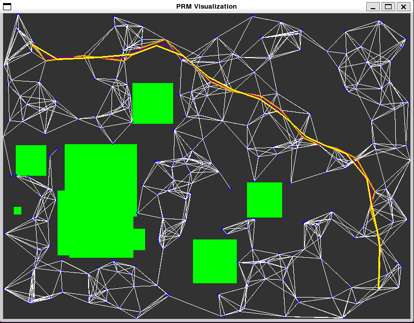
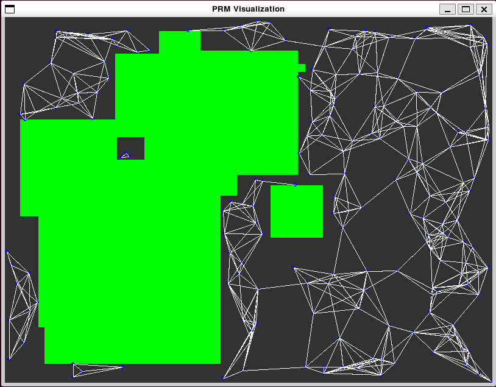

# robot_motion_planning_playground
Fun project to learn more about motion planning for robotics

Currently just implements a basic PRM algorithm and Dijkstra algorithm to find the shortest path.  
I have added some path smoothing to get a better path for a robot to follow. 

I am using Pygame to visualize the environment, and road map.

  
*Image 1: PRM with successful query of shortest path and some path smoothing applied*

  
*Image 1: PRM with an unsuccessful query of shortest path due to not fully connected graph*

## Next Up
1. Will add visualization for the cost of the edges on shortest path
1. Will extend to make PRM algorithm for multi-dof robot manipulators
1. Will extend to 3-D cartesian space and better collision detection 

